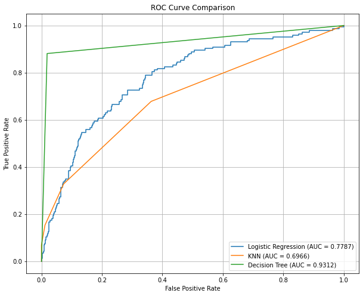

BUSINESS UNDERSTANDING

SyriaTel, a prominent telecommunications company, is confronting the issue of customer churn. To mitigate financial losses and ensure the company's longevity, this project seeks to create a classification model that predicts customer churn by identifying the patterns and factors associated with it. By leveraging these insights, the company can implement proactive strategies to retain customers and promote sustained growth.

PROBLEM STATEMENT

SyriaTel Telecommunications is committed to connecting people through seamless communication. In their continuous quest for excellence, they have faced the challenge of customer churn. Each lost customer not only represents a severed connection but also threatens the company's financial growth and future. By analyzing the factors and patterns associated with churn and developing an effective classification model to predict it, SyriaTel can implement targeted actions to prevent churn and ensure business continuity.

This analysis explores the patterns and predictors of customer churn at SyriaTel, a leading telecommunications provider. By examining customer usage data, service plans, and interaction history, we employ statistical analysis and machine learning models to identify the primary drivers of churn. The study aims to segment the customer base, assess the impact of various service features on customer retention, and develop a predictive model to identify at-risk customers. The insights gained from this analysis will guide targeted interventions to enhance customer satisfaction and loyalty, reduce churn rates, and promote long-term business growth.

FEATURES INCLUDE:

state - Client's residence.
account length - How long they have had the subscription.
area code - Client's area code.
phone number - Client's phone number.
international plan - Is the client subscribed to the international plan?(yes/no).
voice mail plan - Is the client subscribed to the voice mail plan?(yes/no).
number vmail messages - The number of the voicemail messages.
total day minutes, calls, charge - the client's daily minutes, calls, and charges.
total eve minutes, calls, charge - the client's evening minutes, calls, and charges.
total night minutes, calls, charge -the client's night minutes, calls, and charges.
total intl minutes, calls, charge - the client's total international minutes, calls, and charges.
customer service calls - how many times the customer service line was called.
churn - The response variable we will be targeting.

PROJECT PLAN

Data Preparation - Loading Libraries - Loading data - Descriptive Exploration - Data Cleaning - Exploratory Descriptive Analysis (EDA) - Pre-processing Data

Modelling - Train test split  - Logistic Regression- KNN - Decision Tree

CONCLUSION

 The best model was the Decision Tree Model. It exhibited the greatest area under the curve compared to the other models

RECOMMENDATION

1.Customer Service Experience: The analysis indicates a weak positive correlation between customer service calls and churn. SyriaTel should focus on enhancing its customer service experience by providing prompt and effective support, streamlining issue resolution processes, and ensuring a satisfactory customer interaction. Investing in staff training, optimizing response times, and implementing self-service options can help reduce the number of customer service calls and improve overall customer satisfaction.

2.International Plans: The analysis suggests that customers with international plans have a higher churn rate. SyriaTel should assess the value and attractiveness of their international plans and consider offering additional benefits or incentives to retain these customers. Special promotions, discounted rates, or enhanced customer support for international calling can help improve customer satisfaction and reduce churn in this segment.

3.Pricing and Usage Plans: The analysis indicates a strong correlation between the total minutes used and the corresponding charges. SyriaTel can consider offering competitive pricing plans that align with customer usage patterns. This can include options for bundled minutes or customized plans based on peak usage times (day, evening, night) to optimize customer satisfaction and reduce churn.

